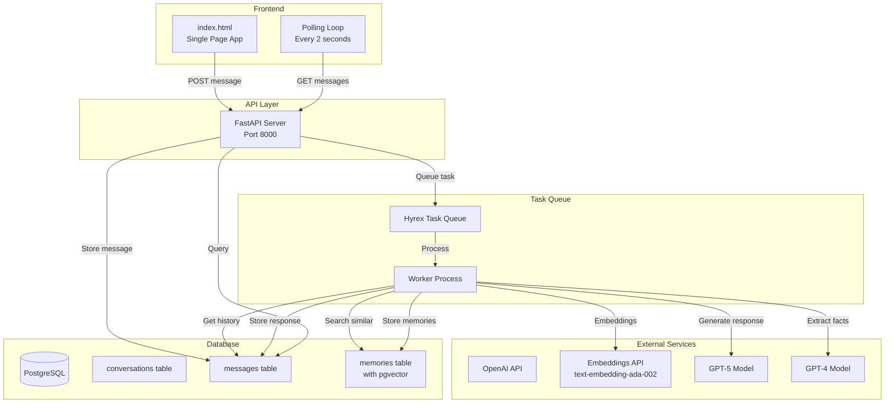
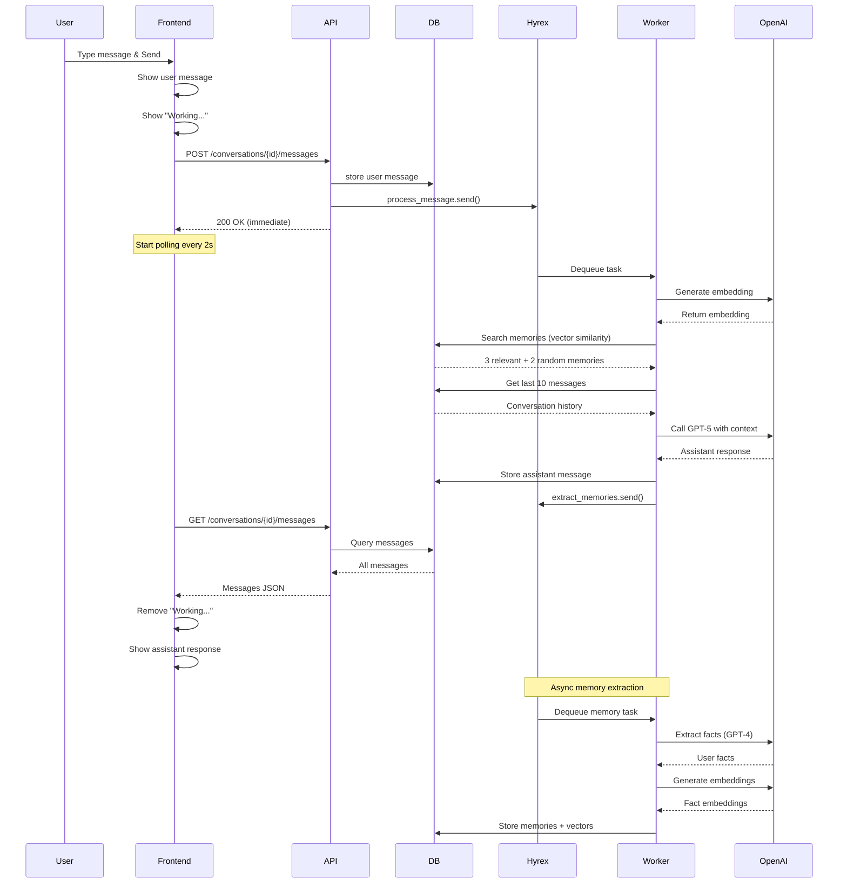
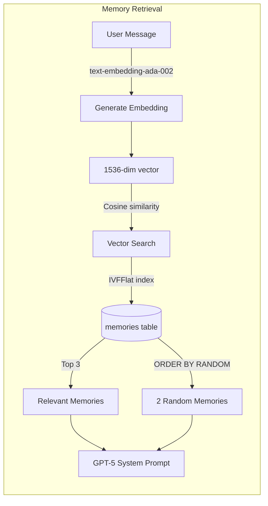

# Chatbot Architecture Flow

## System Architecture

## Message Processing Flow

## Memory Search Flow

## Key Characteristics

- **Non-blocking**: API returns immediately after queuing
- **Async Processing**: Hyrex handles all heavy computation
- **Polling-based Updates**: Frontend discovers completion via polling
- **Dual Memory Selection**: Semantic search + random for serendipity
- **Parallel Tasks**: Memory extraction happens independently
- **Vector Search**: pgvector with IVFFlat indexing for fast similarity
- **Global Memory Bank**: Memories shared across all conversations