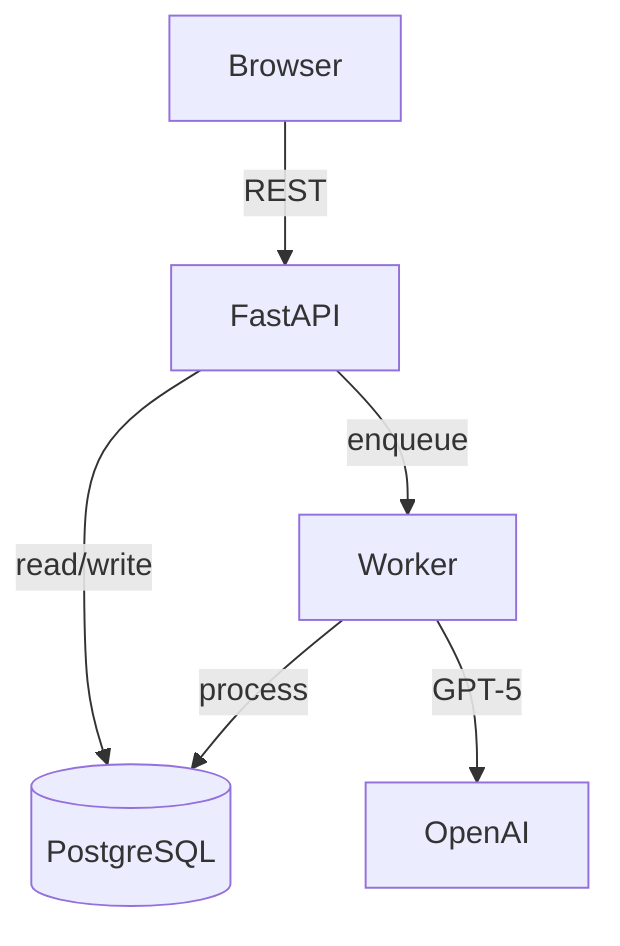
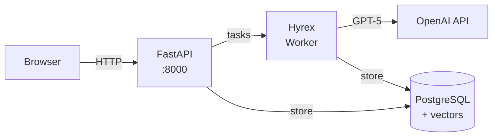

# Simplified Architecture Diagram

## Minimal Version

```mermaid
graph TB
    DB[(PostgreSQL)]
    API[FastAPI]
    WORKER[Worker]
    CLIENT[Browser]
    OPENAI[OpenAI]
    
    CLIENT -->|REST| API
    API -->|read/write| DB
    API -->|enqueue| WORKER
    WORKER -->|process| DB
    WORKER -->|GPT-5| OPENAI
```

## Compact Horizontal Version

```mermaid
graph LR
    CLIENT[Browser] -->|HTTP| API[FastAPI<br/>:8000]
    API -->|tasks| WORKER[Hyrex<br/>Worker]
    WORKER -->|GPT-5| OPENAI[OpenAI API]
    API -->|store| DB[(PostgreSQL<br/>+ vectors)]
    WORKER -->|store| DB
```

Choose whichever version fits better with your blog post layout!