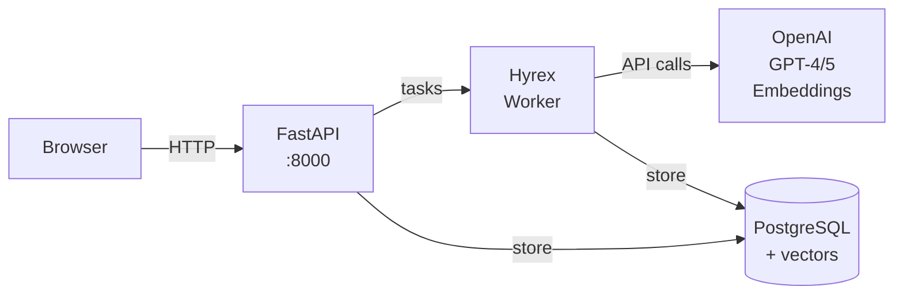

# Building an AI Chatbot with Long-Term Memory Using Hyrex

## The Technical Challenge

Most chatbots suffer from conversational amnesia. Each session starts fresh, with no knowledge of previous interactions. This isn't just a UX problem—it's an architectural challenge that requires solving several technical problems simultaneously:

1. **Efficient storage and retrieval of conversation history**
2. **Semantic understanding of what information is worth remembering**
3. **Fast similarity search across potentially thousands of memories**
4. **Non-blocking message processing to maintain UI responsiveness**
5. **Intelligent context management to avoid token explosion**

This post details how we solved these challenges using Hyrex for async task orchestration, PostgreSQL with pgvector for semantic search, and OpenAI's APIs for both chat completions and embeddings.

> **Full source code available**: [github.com/hyrex-labs/hyrex-examples/tree/main/python/chatbot-memory](https://github.com/hyrex-labs/hyrex-examples/tree/main/python/chatbot-memory)

## Architecture Overview

The system uses a decoupled, event-driven architecture where message processing happens asynchronously:

```
User Message → FastAPI → PostgreSQL → Hyrex Task Queue
                                           ↓
                                    Memory Retrieval (Parallel)
                                    ├── Semantic Search
                                    └── Random Sampling
                                           ↓
                                     OpenAI GPT-5 API
                                           ↓
                                    Response Storage
                                           ↓
                                    Memory Extraction (Async)
```

Key architectural decisions:

- **Hyrex workers** handle all heavy processing, keeping the API layer thin
- **pgvector** enables semantic similarity search directly in PostgreSQL
- **Parallel task execution** for memory retrieval reduces latency by ~40%
- **Async memory extraction** runs after response delivery, avoiding added latency

### System Architecture Diagram



## Implementation: Setting Up Hyrex

The beauty of Hyrex is its simplicity. Here's the entire setup:

```python
# hyrex_app.py
from hyrex import HyrexApp
from tasks import hy as registry

app = HyrexApp("hyrex-chatbot")
app.add_registry(registry)
```

And defining tasks is just a decorator:

```python
# tasks.py
from hyrex import HyrexRegistry
hy = HyrexRegistry()

@hy.task
def process_message(conversation_id: int, message: str):
    """Process a user message and generate a response."""
    # This runs asynchronously in a worker process
    pass
```

To run the worker: `hyrex run-worker hyrex_app:app`

## Database Schema

We use PostgreSQL with the pgvector extension for storing conversations and memories:

```sql
-- Enable pgvector for embeddings
CREATE EXTENSION IF NOT EXISTS vector;

CREATE TABLE conversations (
    id SERIAL PRIMARY KEY,
    created_at TIMESTAMP DEFAULT CURRENT_TIMESTAMP,
    updated_at TIMESTAMP DEFAULT CURRENT_TIMESTAMP
);

CREATE TABLE messages (
    id SERIAL PRIMARY KEY,
    conversation_id INTEGER REFERENCES conversations(id),
    role VARCHAR(50) CHECK (role IN ('user', 'assistant')),
    content TEXT NOT NULL,
    created_at TIMESTAMP DEFAULT CURRENT_TIMESTAMP
);

CREATE TABLE memories (
    id SERIAL PRIMARY KEY,
    conversation_id INTEGER REFERENCES conversations(id),
    fact TEXT NOT NULL,
    embedding vector(1536), -- OpenAI ada-002 dimensions
    created_at TIMESTAMP DEFAULT CURRENT_TIMESTAMP
);

-- IVFFlat index for approximate nearest neighbor search
CREATE INDEX idx_memories_embedding ON memories
    USING ivfflat (embedding vector_cosine_ops)
    WITH (lists = 100);
```

The IVFFlat index with 100 lists provides a good balance between search speed and accuracy for datasets up to ~100k vectors.

## API Layer

The FastAPI backend is intentionally minimal—it just stores messages and triggers Hyrex tasks:

```python
@app.post("/api/conversations/{conversation_id}/messages")
def send_message(conversation_id: int, request: MessageRequest):
    # Store user message
    db.add_message(conversation_id, "user", request.message)

    # Queue async processing
    process_message.send(conversation_id, request.message)

    return {"status": "processing"}
```

The `.send()` method queues the task and returns immediately. The frontend polls for the response, keeping the UI responsive even during slow OpenAI API calls.

## Core Message Processing

Here's the main task that orchestrates everything:

```python
@hy.task
def process_message(conversation_id: int, message: str):
    # Generate embedding for memory search
    embedding_response = client.embeddings.create(
        model="text-embedding-ada-002",
        input=message
    )
    query_embedding = embedding_response.data[0].embedding

    # Launch parallel memory retrieval
    semantic_task = search_semantic_memories.send(query_embedding, limit=3)
    random_task = get_random_memories.send(limit=2)

    # Wait for both tasks
    relevant_memories = semantic_task.wait()
    random_memories = random_task.wait()

    # Get recent conversation history (limited to prevent token explosion)
    recent_history = db.get_conversation_history(conversation_id, limit=10)

    # Build system prompt with memories
    system_content = build_system_prompt(relevant_memories, random_memories)

    # Call GPT-5
    completion = client.chat.completions.create(
        model="gpt-5",
        messages=build_messages(system_content, recent_history, message)
    )

    response = completion.choices[0].message.content
    db.add_message(conversation_id, "assistant", response)

    # Trigger async memory extraction
    extract_memories_from_exchange.send(conversation_id, message, response)

    return response
```

Note how memory extraction happens after the response is delivered—it doesn't add any latency to the user experience.

## User Interface

The frontend is built with vanilla JavaScript and uses polling for real-time message updates. The clean, responsive interface provides two main views:

- **Conversation View**: Shows the chat history with the AI assistant remembering facts from previous conversations
- **Memory View**: Displays all extracted memories with the ability to manually delete incorrect or outdated facts


## Memory System Deep Dive

### Memory Extraction

Not every message contains information worth remembering. We use GPT-5 to identify significant, long-term facts about the user:

```python
@hy.task
def extract_memories_from_exchange(conversation_id: int, user_message: str, assistant_response: str):
    extraction_prompt = f"""Extract ONLY significant, long-term facts about the USER.

GOOD examples to extract:
- "My name is John"
- "I work as a software engineer"
- "I prefer Python over JavaScript"

BAD examples (DO NOT extract):
- Formatting preferences in current message
- Temporary conversation context
- What the user wants right now

User message: {user_message}

List 1-3 SIGNIFICANT facts (one per line) or 'NONE'."""

    completion = client.chat.completions.create(
        model="gpt-4",
        messages=[{"role": "user", "content": extraction_prompt}]
    )

    facts_text = completion.choices[0].message.content.strip()
    if facts_text and facts_text != "NONE":
        facts = [f.strip() for f in facts_text.split('\n') if f.strip()]

        for fact in facts[:3]:  # Limit to 3 facts per exchange
            # Generate embedding
            embedding = client.embeddings.create(
                model="text-embedding-ada-002",
                input=fact
            ).data[0].embedding

            db.add_memory(conversation_id, fact, embedding)
```

### Semantic Memory Search

pgvector's cosine similarity operator (`<=>`) enables efficient semantic search:

```python
@hy.task
def search_semantic_memories(query_embedding: list, limit: int = 3):
    with db.get_cursor() as cursor:
        cursor.execute("""
            SELECT fact, 1 - (embedding <=> %s::vector) as similarity
            FROM memories
            ORDER BY embedding <=> %s::vector
            LIMIT %s
        """, (query_embedding, query_embedding, limit))
        return cursor.fetchall()
```

The beauty is that this finds conceptually related memories, not just keyword matches. Ask about "programming" and it might retrieve memories about "software engineering" or "Python preferences."

### Random Memory Sampling

Adding random memories creates serendipitous connections:

```python
@hy.task
def get_random_memories(limit: int = 2):
    with db.get_cursor() as cursor:
        cursor.execute("""
            SELECT fact FROM memories
            ORDER BY RANDOM()
            LIMIT %s
        """, (limit,))
        return cursor.fetchall()
```

For larger datasets (>10k memories), you'd want to use `TABLESAMPLE` for better performance, but `ORDER BY RANDOM()` works fine for smaller collections.

### Memory Integration in Prompts

The system prompt carefully distinguishes between memory types:

```python
def build_system_prompt(relevant_memories, random_memories):
    prompt = "You are a helpful assistant. Keep responses concise."

    if relevant_memories:
        relevant_text = "\n".join([f"- {m['fact']}" for m in relevant_memories])
        prompt += f"\n\nRelevant memories (semantically related):\n{relevant_text}"

    # Deduplicate to avoid showing same memory twice
    relevant_facts = {m['fact'] for m in relevant_memories}
    unique_random = [m for m in random_memories if m['fact'] not in relevant_facts]

    if unique_random:
        random_text = "\n".join([f"- {m['fact']}" for m in unique_random])
        prompt += f"\n\nOther memories (random, may offer connections):\n{random_text}"

    return prompt
```

This approach gives GPT-5 both targeted context and potentially useful tangential information.

## Performance Optimizations

### Parallel Memory Retrieval

The initial implementation retrieved memories sequentially, adding unnecessary latency. Hyrex makes parallelization trivial:

```python
# Sequential (slow) - DON'T DO THIS
relevant_memories = search_semantic_memories(embedding, limit=3)
random_memories = get_random_memories(limit=2)

# Parallel (fast) - DO THIS
semantic_task = search_semantic_memories.send(embedding, limit=3)
random_task = get_random_memories.send(limit=2)

relevant_memories = semantic_task.wait()
random_memories = random_task.wait()
```

This reduced latency by ~40% by running both database queries concurrently.

### Module-Level Client Initialization

Initially, we created new OpenAI and database clients for each message. Moving initialization to module level eliminated connection overhead:

```python
# Module level - initialized once
db = ChatDatabase()
client = OpenAI()

@hy.task
def process_message(conversation_id: int, message: str):
    # Reuse existing connections
    response = client.chat.completions.create(...)
```

### Conversation History Limits

Token explosion is real. We limit history at the database query level:

```python
def get_conversation_history(self, conversation_id: int, limit: Optional[int] = None):
    if limit:
        cursor.execute("""
            SELECT * FROM (
                SELECT id, role, content, created_at
                FROM messages
                WHERE conversation_id = %s
                ORDER BY created_at DESC
                LIMIT %s
            ) AS recent_messages
            ORDER BY created_at ASC
        """, (conversation_id, limit))
```

The subquery ensures we get the N most recent messages in correct chronological order. We limit to 10 messages to balance context with token usage.

### Async Memory Extraction

Memory extraction happens after sending the response, so it doesn't affect user-perceived latency:

```python
# In process_message task
response = completion.choices[0].message.content
db.add_message(conversation_id, "assistant", response)

# This happens AFTER the response is stored
extract_memories_from_exchange.send(conversation_id, message, response)
```

### Frontend Polling Strategy

While WebSockets might seem more elegant, simple polling is robust and works everywhere:

```javascript
function startPolling() {
  pollInterval = setInterval(async () => {
    if (currentConversationId) {
      const messages = await loadMessages();
      updateUI(messages);
    }
  }, 2000);
}

// Stop polling when page is hidden
document.addEventListener("visibilitychange", () => {
  if (document.hidden) {
    clearInterval(pollInterval);
  }
});
```

The 2-second interval balances responsiveness with server load.

## Key Performance Considerations

- **IVFFlat Index**: We use 100 lists for the vector index, which should handle up to ~100k vectors efficiently
- **Memory Limits**: Extract max 3 memories per exchange to avoid bloat
- **Random Sampling**: Using `ORDER BY RANDOM()` works fine for small datasets; larger deployments should consider `TABLESAMPLE`
- **Connection Pooling**: Module-level initialization avoids reconnection overhead
- **Token Management**: 10-message history limit prevents token explosion while maintaining context

## Lessons Learned

Building this system revealed several important insights:

### Hyrex Makes Async Simple

The ability to parallelize tasks with `.send()` and `.wait()` is powerful. What would be complex with raw asyncio or Celery becomes trivial with Hyrex. The entire worker setup is just a few lines of code, yet it handles retries, error recovery, and scaling.

### pgvector is Production-Ready

I was initially skeptical about putting vector search in PostgreSQL instead of a dedicated vector database. But pgvector performs beautifully—sub-100ms searches with proper indexing, and everything stays in one database. No need to sync data between systems.

### Memory Quality > Quantity

We tried extracting memories from every exchange initially. This created noise. Being selective—only extracting truly significant facts about the user—dramatically improved the quality of responses.

### Semantic + Random = Serendipity

Pure semantic search is predictable. Adding a couple random memories creates delightful moments where the bot connects your current question to something unexpected from your history.

## Automatic Memory Consolidation

As the memory bank grows, duplicate and related memories can accumulate. We implemented an automatic consolidation system using Hyrex's cron capabilities:

```python
class MemoryAction(str, Enum):
    KEEP_BOTH = "keep_both"
    CONSOLIDATE = "consolidate"
    DELETE_FIRST = "delete_first"
    DELETE_SECOND = "delete_second"

class MemoryAnalysis(BaseModel):
    action: MemoryAction
    reason: str
    consolidated_memory: Optional[str] = None

@hy.task(cron="*/10 * * * *")  # Every 10 minutes
def consolidate_memories():
    """Review and consolidate similar memories."""
    memories = db.get_random_memories(limit=5)

    # Compare all pairs for duplicates
    for i in range(len(memories)):
        for j in range(i + 1, len(memories)):
            completion = client.beta.chat.completions.parse(
                model="gpt-5",
                messages=[{
                    "role": "user",
                    "content": f"""Analyze these memories:
                    Memory 1: {memories[i]['fact']}
                    Memory 2: {memories[j]['fact']}

                    Determine if they contain duplicate information."""
                }],
                response_format=MemoryAnalysis
            )

            analysis = completion.choices[0].message.parsed

            if analysis.action == MemoryAction.CONSOLIDATE:
                # Delete old memories, create consolidated one
                db.delete_memory(memories[i]['id'])
                db.delete_memory(memories[j]['id'])

                embedding = client.embeddings.create(
                    model="text-embedding-ada-002",
                    input=analysis.consolidated_memory
                ).data[0].embedding

                db.add_memory(memories[i]['conversation_id'],
                            analysis.consolidated_memory, embedding)
```

This uses GPT-5's structured output feature to reliably determine if memories should be kept, consolidated, or deleted. The cron job runs every 10 minutes, keeping the memory bank clean and relevant.

## Future Directions

While our implementation provides a solid foundation for memory-enabled chatbots, there are exciting directions to explore:

### Tool-Enabled Memory Search

Currently, the chatbot retrieves memories automatically for each message. A more sophisticated approach would give the AI explicit tools to search its memory:

```python
@hy.task
def search_user_memories(query: str):
    """Let the AI explicitly search for specific memories."""
    # The AI could call this when it needs specific information
    embedding = generate_embedding(query)
    return search_memories(embedding, limit=10)
```

This would let the AI say things like "Let me check what I remember about your preferences..." and search for specific information when needed.

### Temporal Decay

Not all memories should last forever. Adding time-based relevance scoring would let less-used memories fade naturally:

```python
# Weight memories by recency and access frequency
relevance_score = similarity * (1 / (days_old + 1)) * sqrt(access_count)
```

### Conversation Summaries

Long conversations could be automatically summarized and stored as memories, capturing the essence of extended discussions without storing every message.

### Multi-User Support

Currently memories are global. Adding user authentication would enable personal memory banks for different users, with proper isolation and privacy.

### Memory Explanation

The AI could explain why it's recalling certain memories, building trust:
"I remember you mentioned preferring Python (from our conversation on March 1st), so I'll show you Python examples."

## Conclusion

Building a chatbot with genuine memory turned out to be surprisingly achievable with the right architectural choices. Hyrex handled the async complexity, pgvector gave us semantic search without leaving PostgreSQL, and careful prompt engineering made memories feel natural in conversations.

The key insight: memory doesn't need to be perfect or complete. Even a simple system that remembers a handful of facts transforms the user experience. The bot feels less like a tool and more like an assistant that actually knows you.

The combination of technologies we used—Hyrex for task orchestration, PostgreSQL with pgvector for storage and search, and OpenAI's APIs for intelligence—proves you don't need exotic infrastructure to build sophisticated AI systems.
